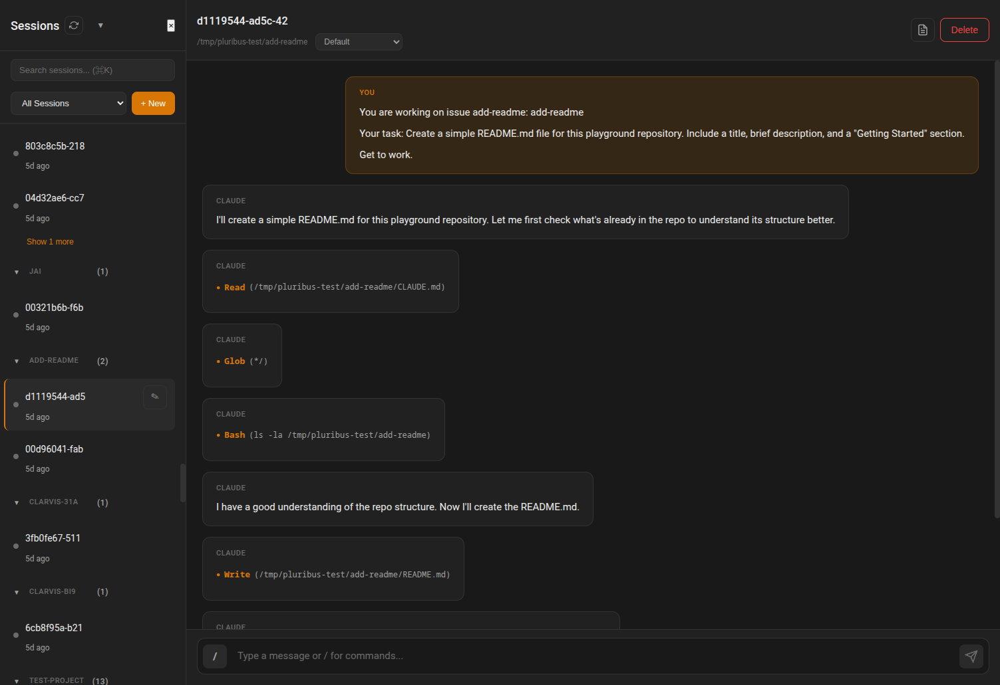
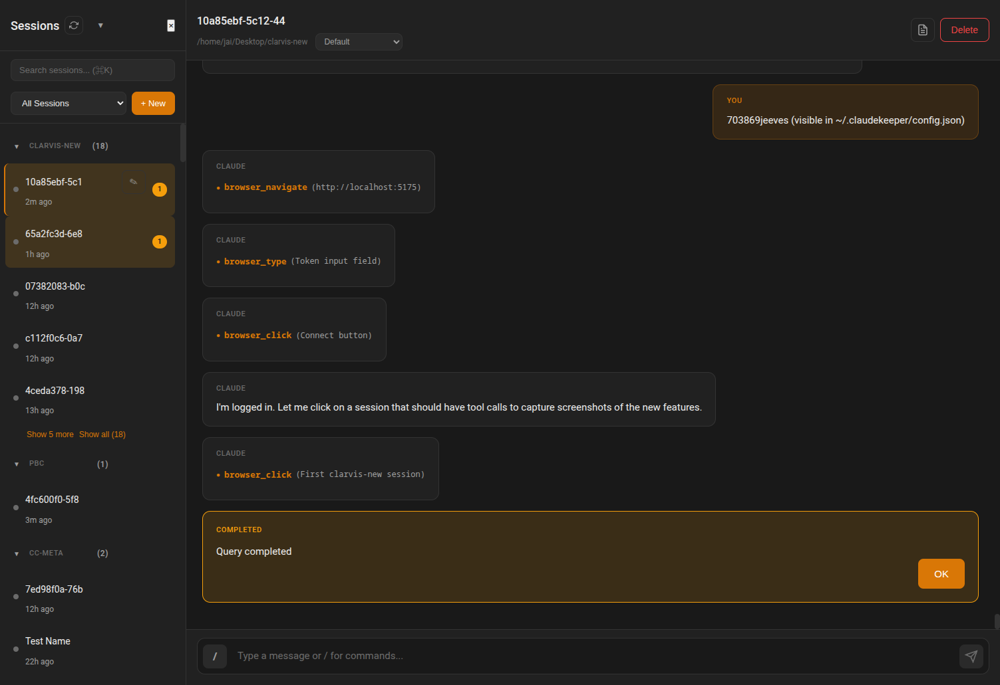
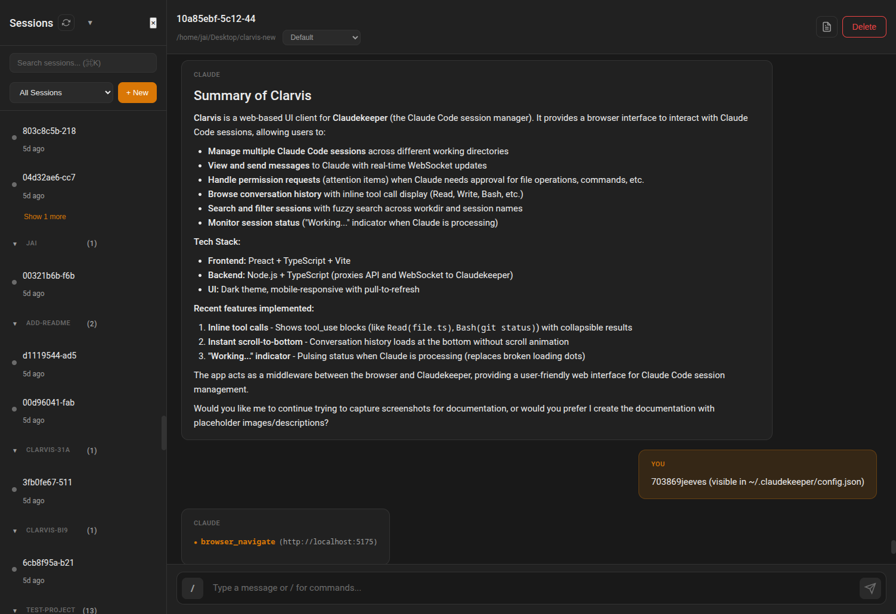

# Clarvis V2 Features

This document describes the new features implemented in Clarvis V2, with annotated screenshots.

## 1. Inline Tool Calls

Tool calls from Claude are now displayed inline within messages, matching the Claude Code terminal experience. Each tool call shows:

- **Tool name** in orange (e.g., `Read`, `Bash`, `Write`, `Glob`)
- **Key parameter** in parentheses (e.g., file path, command)
- **Collapsible results** (click to expand full output)

### Example: Multiple Tool Calls

*Screenshot shows a conversation where Claude reads a file, globs for patterns, runs a bash command, and writes a file. Each tool call is displayed compactly with its key parameter.*

### Example: Browser Automation Tools

*Screenshot shows browser automation tools: `browser_navigate`, `browser_type`, and `browser_click` with their parameters displayed inline.*

## 2. Instant Scroll-to-Bottom

When loading conversation history, Clarvis now:

- **Starts at the bottom** - No more watching the scroll animation through messages
- **Instant positioning** - Uses `useLayoutEffect` to set scroll position before the browser paints
- **Smooth scroll for new messages** - Only new messages during an active session trigger smooth scrolling

This makes switching between sessions feel instant, even for long conversations.

## 3. "Working..." Indicator

When Claude is processing a request, Clarvis now shows a cleaner status indicator:

- **Pulsing orange dot** with "Working..." text
- **Based on session status** - Uses the real `session.status === 'running'` from WebSocket
- **Replaces broken bouncing dots** - The previous loading animation wasn't functioning

The indicator appears whenever the session status is "running" and disappears when Claude finishes processing.

## 4. Session Overview

*The main Clarvis interface showing the session sidebar on the left and conversation on the right. Note the inline tool call at the bottom of the conversation.*

## Technical Implementation

### Files Modified

| File | Changes |
|------|---------|
| `src/components/Chat/Message.tsx` | Complete rewrite to render content blocks in order with inline tool display |
| `src/components/Chat/MessageList.tsx` | Added instant scroll-to-bottom, replaced loading indicator with session status |
| `src/App.tsx` | Updated props passed to MessageList |
| `public/css/main.css` | Added styles for `.tool-block`, `.working-indicator`, and animations |

### Key Design Decisions

1. **Content blocks render in order** - Text, tool_use, and tool_result blocks are rendered in the exact order they appear in the message content array
2. **Smart parameter extraction** - Looks for common parameter names (`command`, `pattern`, `file_path`, `path`, `query`, `url`) to display the most relevant value
3. **MCP tool name cleanup** - Removes `mcp__` prefix from tool names for cleaner display
4. **Session status for loading** - Uses WebSocket-delivered `session.status` rather than local state tracking

## Future Improvements

- **Detailed view (Ctrl+O)** - Full transcript view showing all tool inputs and outputs expanded
- **Token count display** - Show tokens generated during "Working..." state
- **Tool result syntax highlighting** - Apply code highlighting to tool results based on content type
