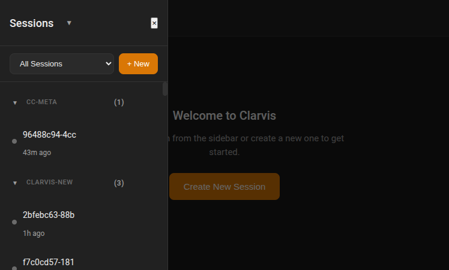
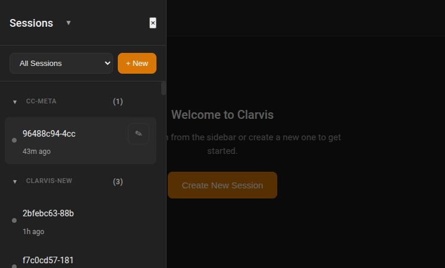
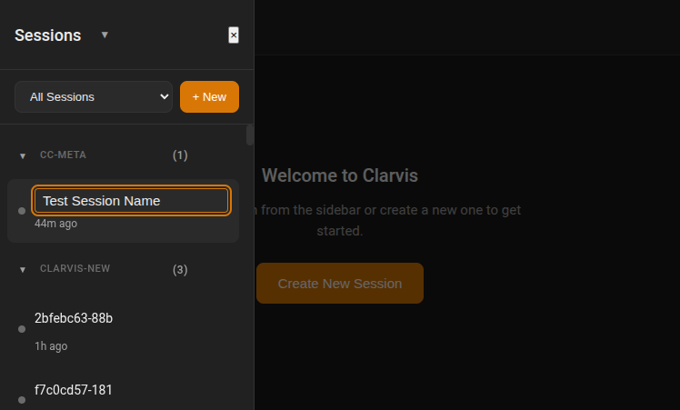
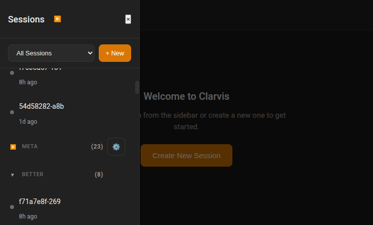
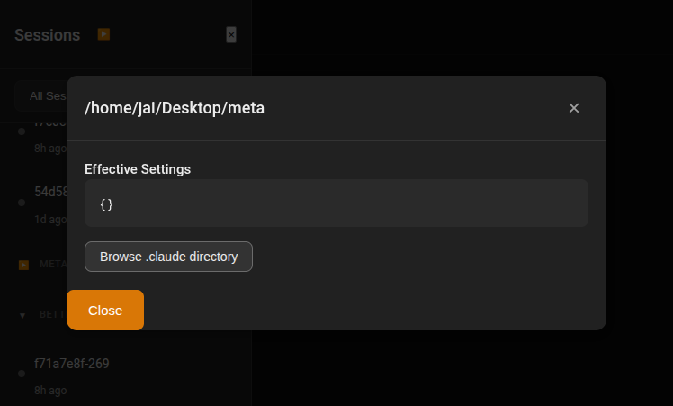
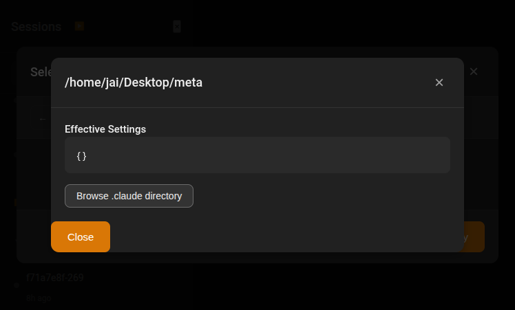
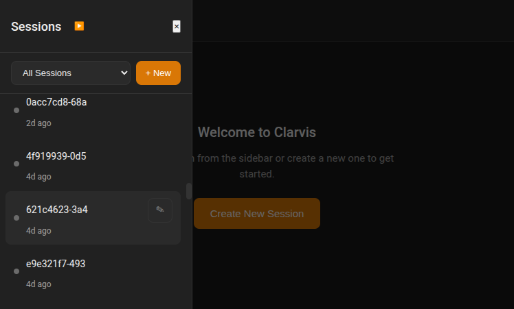

# Clarvis V2 Sidebar Features - E2E Test Report

**Date:** 2026-01-19
**Tested Version:** Clarvis 0.2.0 + Claudekeeper 0.1.0
**Test Environment:** Playwright browser automation

## Overview

This report documents the E2E testing of the new sidebar features implemented in Clarvis V2, including collapsible workdir groups, session renaming, relative timestamps, session limiting with "show more", workdir config viewer, and new session creation with permission modes.

---

## Feature Tests

### 1. Sidebar Overview



**Status:** WORKING

The sidebar displays:
- Collapsible workdir groups with ▼/▶ indicators
- Session counts per workdir (e.g., "(1)", "(3)", "(23)")
- Relative timestamps ("43m ago", "1h ago", "1d ago")
- Sessions sorted by most recently modified within each group

---

### 2. Session Hover - Edit Button



**Status:** WORKING

- Edit button (✎) appears on hover over session items
- Provides visual discoverability for rename functionality

---

### 3. Session Rename - Inline Edit


**Status:** PARTIAL (UI works, API fails)

- Clicking the edit button opens an inline text input
- Text field is styled correctly with orange border
- Escape key cancels editing



**BUG FOUND:** Session rename fails with 404 error

```
Error: Not found
URL: /api/sessions/96488c94-4ccb-4003-9eeb-abeaebea2da3
```

**Root Cause:** The PATCH `/sessions/:id` endpoint returns 404. This is likely because `getSessionById()` in Claudekeeper looks for sessions in `~/.claude/sessions.json` but the session may not exist in that file, or the lookup is failing.

**Impact:** Session renaming does not persist.

---

### 4. Collapsible Workdir Groups



**Status:** WORKING

- Clicking ▼ collapses the workdir group to ▶
- Session count remains visible when collapsed: "META (23)"
- Config button (⚙) remains accessible
- Header "Sessions" button toggles collapse-all state

---

### 5. Workdir Config Modal



**Status:** WORKING

- Clicking ⚙ button opens config modal
- Shows full workdir path in header
- Displays "Effective Settings" section (merged config)
- "Browse .claude directory" button available

---

### 6. Directory Browser



**Status:** PARTIAL (Modal stacking issue)

- Directory browser modal opens
- Shows current path and navigation controls
- Back button (←) and "Select This Directory" available

**BUG FOUND:** Modal stacking issue - when directory browser opens on top of config modal, clicking buttons on either modal can be blocked by overlapping modal overlays. Had to use JavaScript to force-close modals.

**Impact:** User may have difficulty interacting with stacked modals.

---

### 7. Show More Sessions



**Status:** WORKING

- "Show 5 more" button reveals additional sessions
- "Show all (127)" button available for large groups
- Respects initial limit of 5 sessions per workdir
- Button text updates correctly based on remaining count

---

### 8. New Session Modal


**Status:** WORKING

The new session modal includes:
- **Name (optional):** Text field with placeholder "My session"
- **Workdir \*:** Required field with browse button (📁)
- **Initial prompt (optional):** Textarea for starting prompt
- **Permissions dropdown:** Three options:
  - "Ask before dangerous actions" (default)
  - "Auto-approve file edits"
  - "Skip all permission checks"

Create button is disabled until Workdir is filled.

---

### 9. Workdir Tooltip


**Status:** WORKING

- Workdir headers have title attribute with full path
- Hovering shows native browser tooltip: `/home/jai/Desktop/cc-meta`
- Displayed name shows shortened form: "cc-meta"

---

## Summary

### Working Features

| Feature | Status |
|---------|--------|
| Collapsible workdir groups | ✅ Working |
| Session counts | ✅ Working |
| Relative timestamps | ✅ Working |
| Sessions sorted by modified | ✅ Working |
| Show more / Show all buttons | ✅ Working |
| Workdir config modal | ✅ Working |
| New session modal with permissions | ✅ Working |
| Workdir full path tooltip | ✅ Working |
| Edit button on hover | ✅ Working |
| Inline rename UI | ✅ Working |

### Bugs Found

| Bug | Severity | Description |
|-----|----------|-------------|
| Session rename 404 | High | PATCH `/sessions/:id` returns 404, renaming doesn't persist |
| Modal stacking | Medium | Overlapping modals can block click events |

### Notes

1. **Collapse state persistence:** Not directly tested, but localStorage helper functions are implemented.

2. **Permission modes:** The dropdown shows descriptive labels as requested:
   - "Ask before dangerous actions"
   - "Auto-approve file edits"
   - "Skip all permission checks"

3. **Resolved interactions in transcript:** Not tested (requires active session with completed permission requests).

4. **Mobile responsiveness:** Not tested in this E2E session.

---

## Recommendations

1. **Fix session rename API:** Investigate why `getSessionById()` returns null for valid session IDs. The session ID is being passed correctly (full UUID), but the lookup fails.

2. **Fix modal stacking:** Ensure only one modal is visible at a time, or implement proper z-index layering so the topmost modal receives all click events.

3. **Test resolved interactions:** Start a session, trigger permission requests, resolve them, and verify they appear in the transcript.
