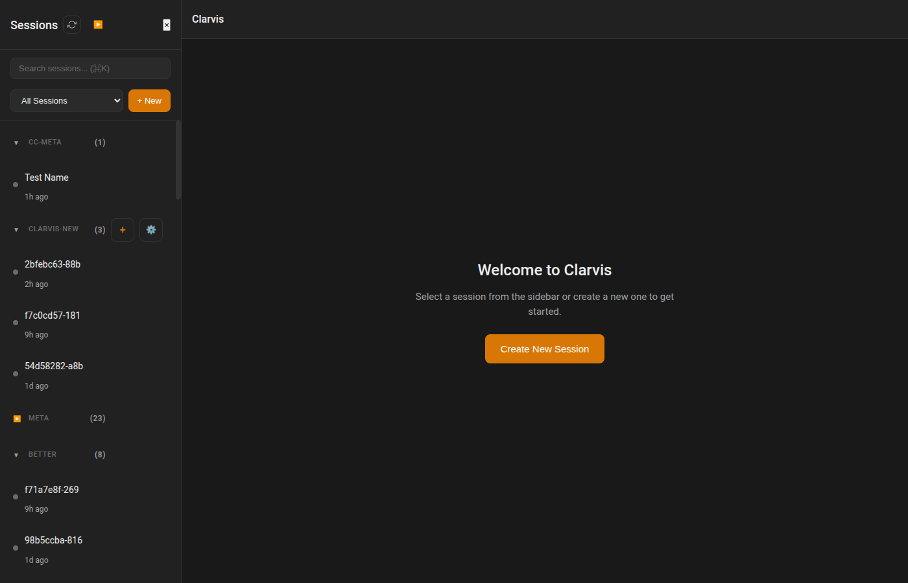
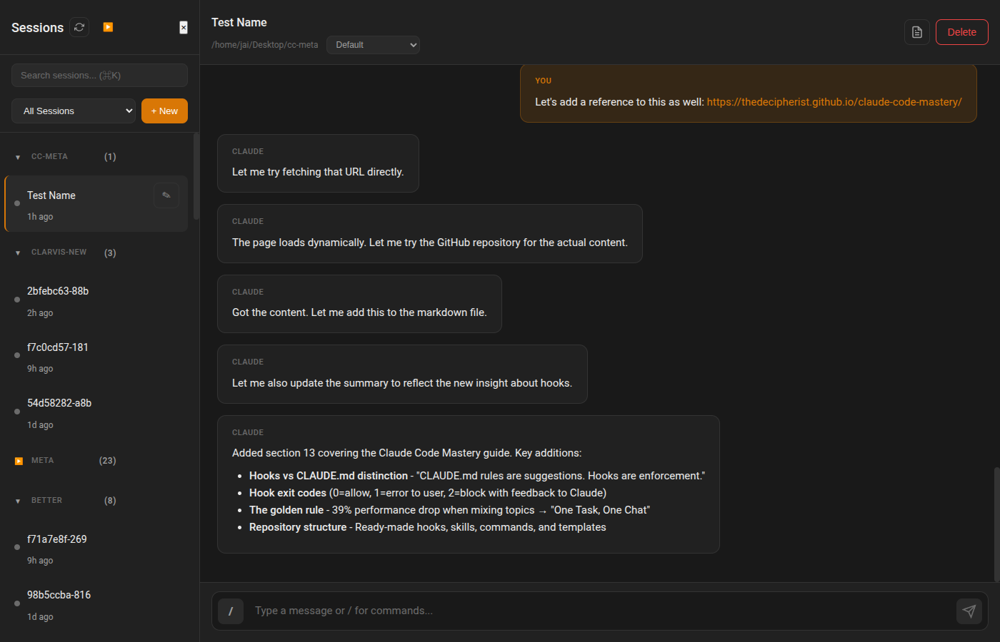
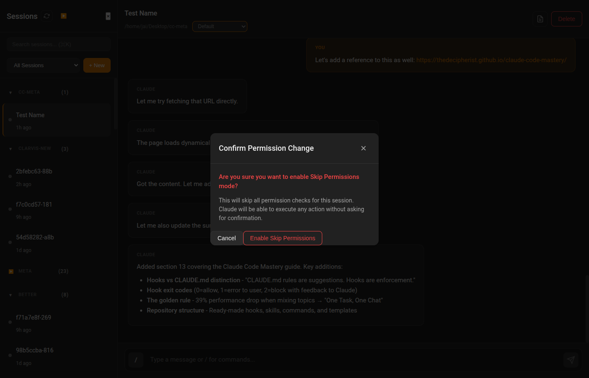
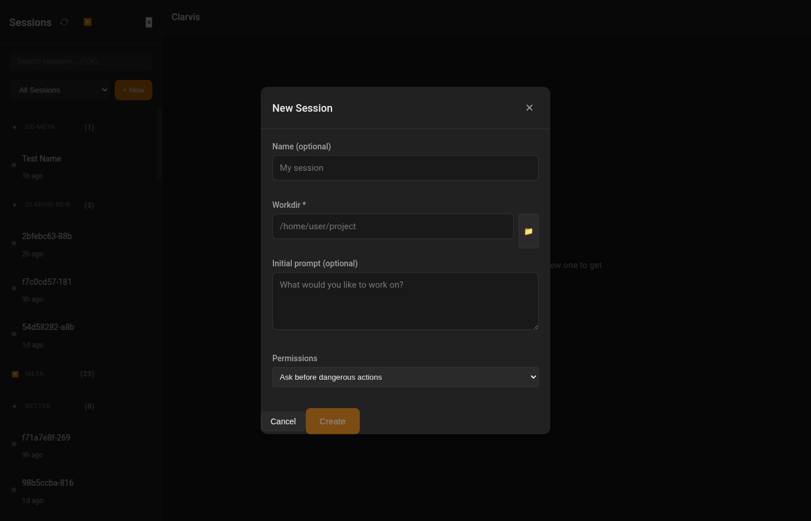
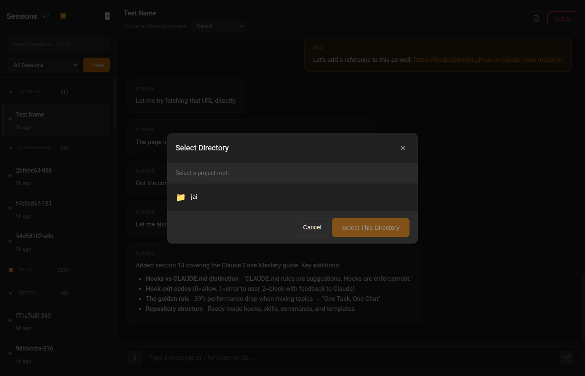

# Clarvis V2 Features

This document describes the new features added to Clarvis in the January 2026 update.

## Overview

The V2 update focuses on improving session management, search/filtering, and permission controls in the sidebar.

---

## 1. Sidebar Search with Fuzzy Matching

A search box at the top of the sidebar allows filtering sessions using fuzzy matching powered by [Fuse.js](https://fusejs.io/).

**Features:**
- Fuzzy matches against session names and workdir names
- Workdirs containing matching sessions auto-expand during search
- Keyboard shortcuts:
  - `Cmd/Ctrl+K` - Focus search box
  - `Escape` - Clear search and unfocus


*Searching for "meta" filters to show matching sessions*

---

## 2. Per-Workdir New Session Button (+)

Each workdir group now has a `+` button that creates a new session with the working directory pre-populated.

**Features:**
- Button appears on hover next to the workdir name
- Opens the new session modal with workdir field pre-filled
- User can still change the directory if desired


*The + and gear buttons appear when hovering over a workdir*

---

## 3. Refresh Button

The sidebar header includes a refresh button to reload the session list.

**Features:**
- Click to refresh sessions and attention data
- Spinning animation while refreshing
- Pull-to-refresh support on mobile (touch devices)


*The refresh button is in the sidebar header, next to "Sessions"*

---

## 4. Permission Mode Dropdown

Sessions now display a permission mode dropdown in the header, allowing you to change how Claude handles permissions.

**Permission Modes:**
- **Default** - Ask before dangerous actions
- **Plan Mode** - Planning only, no code execution
- **Skip Permissions** - Skip all permission checks (dangerous)


*The permission dropdown is shown below the session name*

### Confirmation for Dangerous Mode

When selecting "Skip Permissions", a confirmation dialog is shown to prevent accidental activation.


*Confirmation dialog when enabling Skip Permissions mode*

---

## 5. New Session Modal Improvements

The new session modal has been enhanced with several improvements.

**Features:**
- Permission mode dropdown in the modal
- Directory picker opens as a child modal (doesn't close the new session modal)
- Auto-naming from first message if no name is provided


*New session modal with permission mode selection*

### Modal Stacking

The directory picker now opens as a "child" modal, stacking on top of the new session modal rather than replacing it. When the directory picker is closed, the new session modal is preserved.


*The directory picker stacks on top of the new session modal*

---

## 6. Detailed View Toggle

The detailed view button (document icon) toggles visibility of agent activity including:
- Chain of Thought (CoT) reasoning
- Tool calls and their results

**Keyboard shortcut:** `Ctrl/Cmd+O`

---

## 7. Auto-Naming Sessions

Sessions without an explicit name are automatically named from the first user message (up to 128 characters). This happens at session creation time, not as a display-only feature.

If the message exceeds 128 characters, it's truncated at the last word boundary with "..." appended.

---

## Technical Notes

### Libraries Added
- **Fuse.js** (`public/js/lib/fuse.mjs`) - Fuzzy search library

### Permission Modes Constant
Permission modes are defined once in `app.js` and referenced throughout:

```javascript
const PERMISSION_MODES = [
  { value: 'default', label: 'Default', description: 'Ask before dangerous actions' },
  { value: 'plan', label: 'Plan Mode', description: 'Planning only, no code execution' },
  { value: 'dangerously-skip-permissions', label: 'Skip Permissions', description: 'Skip all permission checks (dangerous)', dangerous: true }
]
```

### Modal Stacking System
Modals use a stack-based system with parent-child relationships:
- Child modals (like file browser from new session) stack on top
- Non-related modals replace the entire stack
- The `MODAL_CHILDREN` constant defines which modals can be children of others
