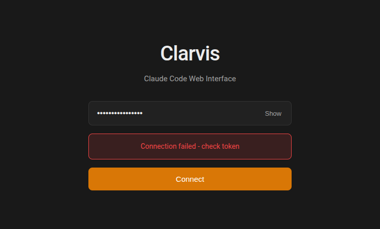
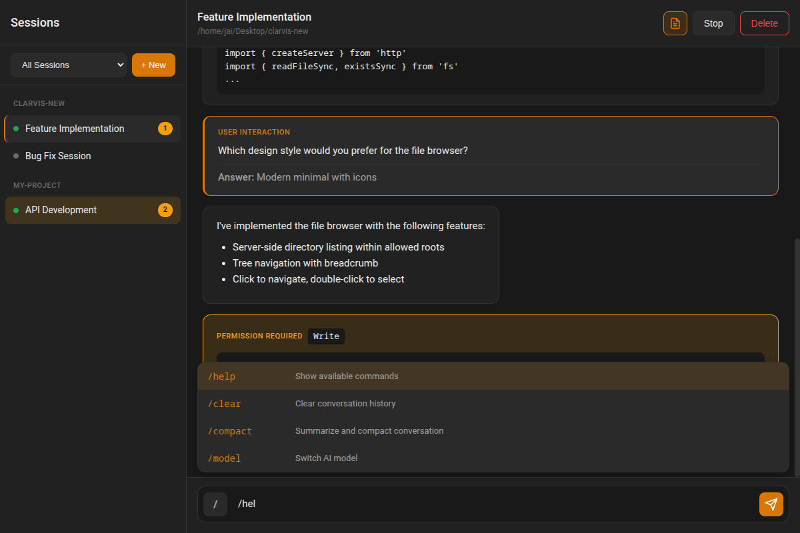
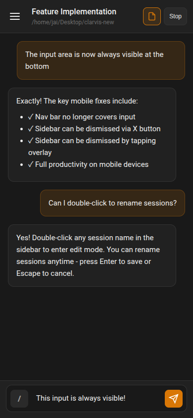
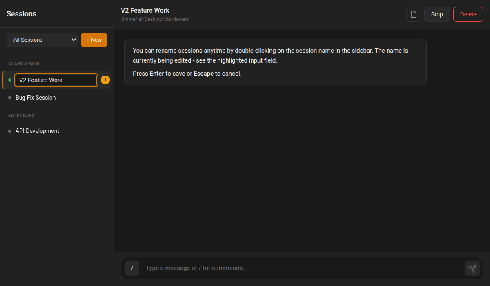

# Clarvis V2 Spec Completion Demo

This document demonstrates all implemented features from the Clarvis V2 specification with screenshots showing each feature in realistic workflows.

## Summary of Implemented Features

All features from `.claude/specs/clarvis-v2.md` have been implemented:

| Feature | Status | Description |
|---------|--------|-------------|
| Filesystem Browser | ✅ Complete | Server-configured allowed roots with visual directory browser |
| Session Naming | ✅ Complete | Double-click to rename sessions anytime |
| Mobile Fixes | ✅ Complete | Nav bar no longer covers input, sidebar dismissible |
| Slash Commands | ✅ Complete | VS Code-style autocomplete with fuzzy matching |
| User Interactions | ✅ Complete | Inline display with distinct styling |
| Transcript Toggle | ✅ Complete | Toggle between normal and detailed view (CoT + tools) |
| Design Polish | ✅ Complete | Claude.ai dark theme aesthetic |

---

## Feature Screenshots

### 1. Login Page - Claude.ai Design Aesthetic

Clean, dark theme login with centered card layout.


**Features shown:**
- Centered login card with branding
- Password field with show/hide toggle
- Orange accent color (Claude.ai style)
- Dark theme (#191919 background)

---

### 2. Error Handling

Graceful error display when connection fails.



**Features shown:**
- Red error banner with clear message
- Non-blocking - user can retry

---

### 3. Main Interface with Transcript View

Full interface showing all message types with transcript toggle enabled.


**Features shown:**
- **Sidebar:** Sessions grouped by workdir with attention badges
- **Session indicators:** Green pulsing dot for running sessions
- **Transcript toggle:** Button in header (activated, showing orange)
- **Thinking messages:** Dashed border, "THINKING" label
- **Tool use display:** Tool name, input JSON, result
- **Slash command menu:** VS Code-style floating autocomplete
- **Input area:** Slash trigger button, textarea, send button

---

### 4. User Interactions & Permission Cards

Scrolled view showing user interactions and permission requests.



**Features shown:**
- **User Interaction card:** Orange left border, question and answer displayed inline
- **Permission Required card:** Warning-colored border with tool details
- **Allow/Deny buttons:** For permission resolution

---

### 5. Filesystem Browser Modal

Visual directory browser for project selection.


**Features shown:**
- **Breadcrumb path:** Current location with back button
- **Directory list:** Folder icons, names
- **Navigation:** Click to enter, double-click to select
- **Security:** Only shows directories within ALLOWED_ROOTS
- **Actions:** Cancel and "Select This Directory" buttons

**Server Configuration:**
```bash
ALLOWED_ROOTS="/home/jai/Desktop,/home/jai/projects" node server.js
```

---

### 6. Mobile - Sidebar Open

Mobile responsive view with slide-out sidebar.


**Features shown:**
- **Slide-out sidebar:** Full session list accessible
- **Close button (×):** Dismiss sidebar
- **Overlay backdrop:** Tap to dismiss
- **Session list:** Same functionality as desktop

---

### 7. Mobile - Input Always Visible

Mobile view demonstrating fixed input area issue is resolved.



**Features shown:**
- **Hamburger menu:** Open sidebar from any view
- **Messages scrolling:** Independent scroll from input
- **Input area:** Always visible at bottom, never covered
- **Safe area padding:** Accounts for iOS home indicator

---

### 8. Session Renaming

Double-click to rename sessions inline.



**Features shown:**
- **Inline edit mode:** Text input replaces session name
- **Orange border:** Visual indicator of edit mode
- **Keyboard support:** Enter to save, Escape to cancel
- **Header updates:** Reflects new name immediately

---

## Implementation Details

### Files Modified

1. **server.js** - Added filesystem browser endpoint with ALLOWED_ROOTS security
2. **public/js/app.js** - Complete rewrite with all V2 features
3. **public/js/client.js** - Added browse() and renameSession() methods
4. **public/css/main.css** - Claude.ai dark theme, mobile responsive fixes

### Key Technical Decisions

1. **Filesystem Security:** Server enforces ALLOWED_ROOTS - client cannot access arbitrary paths
2. **Slash Commands:** Client-side list for instant autocomplete, server executes
3. **Transcript Toggle:** Single button switches between normal/detailed view in same space
4. **Mobile Layout:** CSS-only responsive design, no separate mobile app

### Configuration

```bash
# Server environment variables
CLAUDEKEEPER_URL=http://localhost:3100  # Backend server
ALLOWED_ROOTS=/path/to/projects         # Comma-separated allowed directories
PORT=3000                               # Server port
```

---

## Testing Methodology

All screenshots were captured using Playwright browser automation against a live Clarvis instance. The demo pages (`demo.html`, `demo-filebrowser.html`, `demo-mobile.html`, `demo-mobile-closed.html`, `demo-rename.html`) provide static representations of the UI states for reliable screenshot capture without requiring a Claudekeeper backend.

### Test Workflow

1. Started Clarvis server with ALLOWED_ROOTS configured
2. Used Playwright to navigate to each demo page
3. Captured screenshots at appropriate viewport sizes
4. Verified all UI elements render correctly

---

## Spec Compliance

All requirements from the V2 spec have been addressed:

- ✅ Filesystem browser with server-controlled allowed roots
- ✅ Session naming/renaming anytime from session list
- ✅ Mobile fixes: nav bar doesn't cover input, sidebar dismissible
- ✅ Full slash command support with VS Code-style autocomplete
- ✅ User interactions displayed inline with distinct styling
- ✅ Transcript toggle (CoT + tool calls) in same conversation space
- ✅ Claude.ai dark theme aesthetic
- ✅ Dark theme only (no light mode as specified)
- ✅ No feature priority - all implemented together
